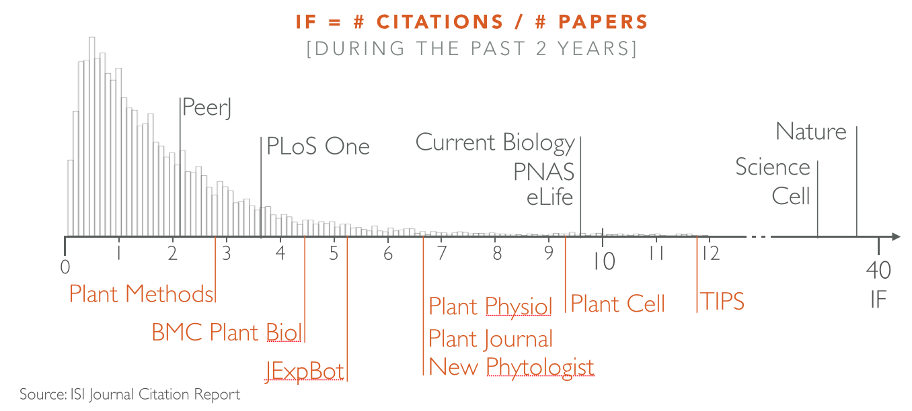
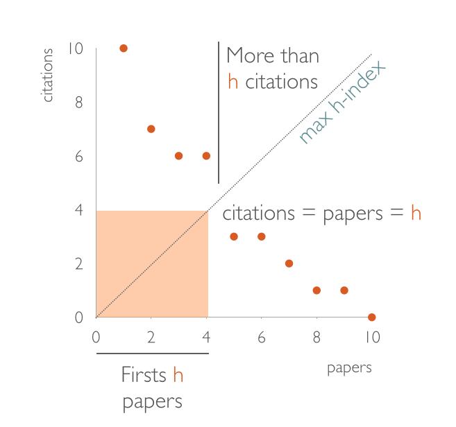
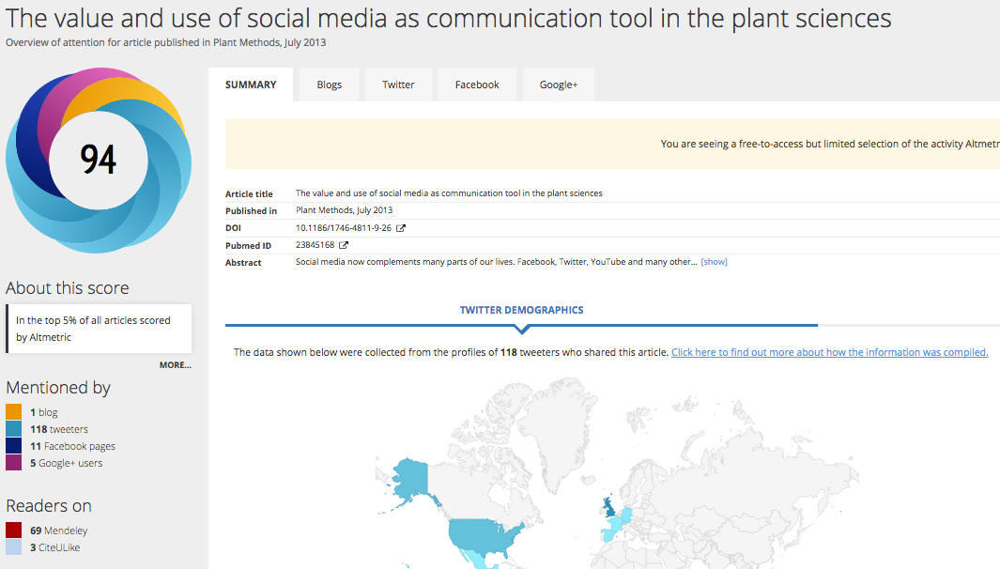

# Scientific valorisation: getting the most out of your research

	Guillaume Lobet
	University of Liege - PhytoSYSTEMS
	guillaume.lobet@ulg.ac.be
	www.guillaumelobet.be
	@guillaumelobet

## Outline

1. Present your research topic

2. [Scientometrics](#anchor1)
	- Introduction
	- Group discussions
		- In my field of research, what do I know about:
			- the journal impact factors
			- the researchers h-index
		- What are the limitations of
			- impact factor
			- h-index
			- altmetrics
	- Sharing and conclusions
	
3. [Scientific production](#anchor2)
	- Group discussions
		- What type of scientific product do I produce?
		- How can I valorise my production (what do I already do?)
	- Sharing
	- Tools presentations
	- In practice
	
	
## [Scientometrics](id:anchor1)

Wikipedia:

> Scientometrics is the study of measuring and analysing science, technology and innovation. Major research issues include the measurement of impact, reference sets of articles to investigate the impact of journals and institutes, understanding of scientific citations, mapping scientific fields and the production of indicators for use in policy and management contexts

### Journal level: Impact factor

#### Definition

Wikipedia: 

> The impact factor (IF) of an academic journal is a measure reflecting the average number of citations to recent articles published in that journal.

$$IF = {n_{citations} \over n_{papers}}$$

#### Source
- ISI Journal Citation Report
	- [http://apps.webofknowledge.com/]()
	- [http://www.citefactor.org/journal-impact-factor-list-2014.html]()

#### Critics

- Influenced by
	- trendiness
	- readership
	- publicity
	- field
- Average of all papers
	- potential influence of *start* article
	- higher for reviews

----

### Researcher level: h-index

#### Definition

> A scientist has index h if h of his/her n papers have at least h citations each, and the other (n − h) papers have no more than h citations each.

#### Source

#### Critics

### Article level: Altmetrics

#### Definition

Wikipedia:

> altmetrics are non-traditional metrics proposed as an alternative to more traditional citation impact metrics, such as impact factor and h-index.

#### Source

#### Drawbacks

## [Scientific production](id:anchor2)

